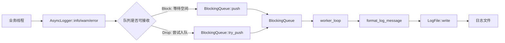

# async_logger 设计说明

这份文档说明 `async_logger` 的内部结构、线程模型、生命周期语义和当前边界。它不是使用手册，使用方式见根目录 `README.md`。

## 设计目标

`async_logger` 的目标是用尽量少的依赖展示一个可工作的异步文件日志库：

- 业务线程不直接负责格式化和写磁盘。
- 使用有界队列控制内存上限。
- 队列满时有明确策略：阻塞等待或立即丢弃。
- 后台线程负责统一写文件，保证单条日志按行输出。
- 对外提供清晰的收尾接口：`flush()` 和 `stop()`。

这个项目更偏学习和展示，不追求和成熟日志库在功能、极限性能、可观测性上的完整对齐。

## 模块划分

| 模块 | 文件 | 职责 |
| :-: | :-: | :-: |
| `LogLevel` | `include/asynclogger/log_level.h`、`src/log_level.cpp` | 定义日志级别，并把级别转换为文本。 |
| `LogMessage` | `include/asynclogger/log_message.h`、`src/log_message.cpp` | 保存一条日志的结构化数据，并格式化成单行文本。 |
| `BlockingQueue<T>` | `include/asynclogger/blocking_queue.h` | 有界线程安全队列，支持阻塞提交、非阻塞提交、阻塞消费和关闭。 |
| `LogFile` | `include/asynclogger/log_file.h`、`src/log_file.cpp` | 管理文件打开、写入、刷新和按大小滚动。 |
| `AsyncLogger` | `include/asynclogger/async_logger.h`、`src/async_logger.cpp` | 组织生产者线程、队列、后台 worker、文件写入和生命周期。 |

## 数据流



核心思路是把“日志提交”和“文件写入”解耦。业务线程只把消息交给队列，后台 worker 串行消费队列并写入文件。

## 队列与背压

`BlockingQueue<T>` 是有界队列，容量来自 `LoggerConfig::max_queue_size`。如果传入 `0`，构造函数会把容量修正为 `1`，避免出现永远无法接收元素的队列。

队列提供两种提交方式：

- `push(T item)`：队列满时等待 `not_full_`，直到队列有空间或队列被关闭。
- `try_push(T item)`：队列满时立刻返回 `false`，不阻塞调用线程。

这两种方法正好对应 `AsyncLogger` 的两种过载策略：

- `OverflowPolicy::Block` 用 `push()`，强调不主动丢日志，但业务线程可能被日志系统拖慢。
- `OverflowPolicy::Drop` 用 `try_push()`，强调保护业务线程延迟，但高峰期可能丢日志。

`close()` 会设置关闭标记，并唤醒所有等待 `not_empty_` 和 `not_full_` 的线程。这样阻塞在生产或消费路径上的线程都能尽快退出等待。

## AsyncLogger 生命周期

`AsyncLogger` 构造时创建后台 worker 线程：

```cpp
worker_([this] { worker_loop(); })
```

析构函数调用 `stop()`，所以普通栈对象离开作用域时会自动收尾。`stop()` 是幂等的，重复调用不会重复关闭或重复 join。

生命周期步骤：

1. 构造 `AsyncLogger`。
2. 业务线程调用 `info()`、`warn()`、`error()`。
3. 每次提交先创建 `LogMessage`，再尝试入队。
4. 后台 worker 调用 `queue_.pop()` 消费消息。
5. worker 格式化消息并写入 `LogFile`。
6. `flush()` 等待已提交消息处理完成，再刷新文件流。
7. `stop()` 停止接收新消息，关闭队列，等待 worker 消费完队列中已有消息并退出。

## 返回值语义

`log()`、`info()`、`warn()`、`error()` 都返回 `bool`：

- `true` 表示消息已经被接受进入队列。
- `false` 表示消息没有被接受，常见原因是 logger 已停止，或 Drop 策略下队列已满。

这个返回值不表示消息已经写入磁盘。写入磁盘由后台 worker 完成。如果调用方需要等待当前已提交消息处理完成，应调用 `flush()`；如果需要关闭 logger，应调用 `stop()` 或依赖析构函数。

Drop 策略下，调用方应该统计返回值。只统计调用次数会把被拒绝的日志也算进吞吐，压测结果会失真。

## flush 的 pending 计数

`AsyncLogger` 维护 `pending_count_`，表示“已经提交但尚未完成处理”的消息数量。

提交路径：

1. `increment_pending()` 先增加 pending。
2. 尝试入队。
3. 如果入队失败，调用 `cancel_one_message()` 抵消 pending，并累计 `dropped_count_`。
4. 如果入队成功，worker 写完或处理失败后调用 `finish_one_message()` 减少 pending。

`flush()` 做两件事：

1. 等待 `pending_count_ == 0`。
2. 加锁调用 `file_.flush()`。

这个设计保证 `flush()` 返回时，调用 `flush()` 之前已经被接受的消息都处理完了。注意，如果其他线程在 `flush()` 等待期间持续提交新日志，`flush()` 也可能继续等待这些新 pending，所以它更适合作为阶段性收尾接口。

## stop 的关闭语义

`stop()` 的关键步骤：

1. 使用 `stopped_.exchange(true)` 原子地设置停止标记。
2. 调用 `queue_.close()`，让队列不再接收新元素，并唤醒等待线程。
3. 如果 worker 可 join，则等待 worker 退出。
4. 最后刷新文件流。

`log()` 开头会检查 `stopped_`。一旦停止，新的日志提交会返回 `false`。队列关闭后，worker 仍会消费队列里已经存在的消息；当队列为空且已关闭时，`pop()` 返回 `false`，worker 退出循环。

## 文件写入与滚动

`LogFile` 使用懒打开策略：第一次写入时才创建父目录并打开文件。

写入流程：

1. `open_if_needed()` 确保文件流已打开。
2. `roll_if_needed(next_write_size)` 判断是否需要滚动。
3. `stream_.write()` 写入当前日志行。
4. 更新当前文件大小计数。

滚动规则：

- `roll_size_bytes == 0` 时禁用滚动。
- 当前文件为空时，即使单条日志超过阈值，也直接写入当前文件。
- 当前文件非空，并且 `current_size + next_write_size > roll_size_bytes` 时，关闭当前文件，递增滚动索引，打开 `base_path.N`。

当前基础日志文件使用 `std::ios::trunc` 打开，所以重新运行程序会覆盖同名基础日志文件。

## 线程安全边界

主要同步点如下：

- `BlockingQueue` 内部用一个 mutex 和两个 condition variable 保护队列状态。
- `stopped_` 是原子变量，用来快速拒绝停止后的新日志。
- `pending_count_` 由 `pending_mutex_` 和 `pending_cv_` 保护。
- `file_` 由 `file_mutex_` 保护，避免 `flush()`、`stop()` 和 worker 同时操作文件流。
- `dropped_count_` 是原子计数，用于统计被拒绝或后台写入失败的消息。

当前实现只有一个 worker，所以正常写入路径本身是串行的。`file_mutex_` 仍然有价值，因为外部线程可能调用 `flush()` 或 `stop()`。

## 错误处理

生产者路径中，如果队列拒绝消息，`log()` 返回 `false`，并增加 `dropped_count_`。

worker 写文件时捕获所有异常，避免后台线程异常逃逸导致进程终止。如果写入失败，会增加 `dropped_count_`，然后继续处理后续消息。

当前没有错误回调、错误码查询或日志系统自诊断接口。生产环境使用前，建议补充更明确的错误上报能力。

## 测试覆盖点

当前测试覆盖了这些核心行为：

- 基础日志写入和 `flush()`。
- 析构函数 drain 已提交消息。
- `stop()` 幂等，并拒绝停止后的日志。
- Block 策略下多线程日志不丢失。
- Drop 策略下 accepted 和 dropped 计数一致。
- 按大小滚动日志文件。
- 后台写文件失败会被计入 dropped。

这些测试主要验证语义正确性，不等价于完整压力测试。

## 当前限制

- 单 worker，不能利用多个后台线程并行格式化或写入。
- 日志格式固定，不支持自定义 pattern。
- 滚动只按大小，不支持按日期或按小时。
- 不清理、不压缩旧日志。
- 没有同步日志模式。
- 没有日志级别过滤。
- 没有错误回调或状态查询接口。
- benchmark 只统计吞吐，不统计延迟分位数。

## 可演进方向

优先级较高的改进：

- 增加日志级别过滤，避免低级别日志进入队列。
- 增加错误回调或状态快照，例如最近一次文件错误、累计写入失败数。
- 增加自定义 formatter。
- 支持 append 模式，由配置决定是否覆盖旧基础日志文件。
- benchmark 增加多轮运行、CSV 输出和延迟分位数。

更进一步的改进：

- 支持按日期滚动和旧文件保留策略。
- 支持多 sink，例如控制台、文件、网络。
- 支持批量 pop 和批量写入，减少锁和系统调用开销。
- 支持异步日志库的安装导出规则，便于被其他 CMake 项目消费。
